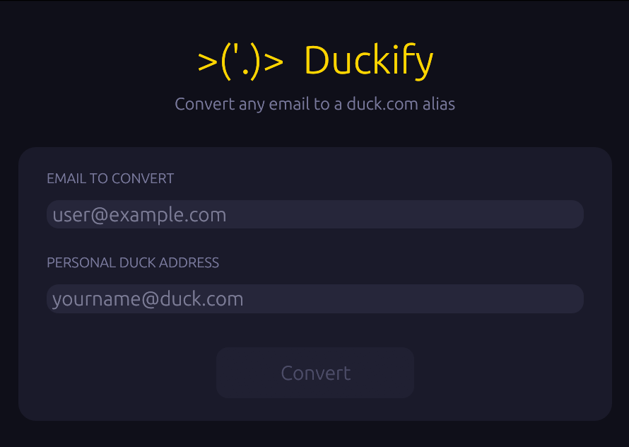

# Duckify

A minimal native desktop app that converts any email address into a [DuckDuckGo Email Protection](https://duckduckgo.com/email/) alias — instantly copied to your clipboard.



```
user@example.com  →  user_at_example.com_yourname@duck.com
```

---

## Install

### macOS — Homebrew (recommended)

```bash
brew tap draugvar/duckify
brew install --cask duckify
```

### All platforms — pre-built binaries

Download the latest release from the [Releases](../../releases) page:

| Platform | File |
|----------|------|
| macOS (Apple Silicon + Intel) | `duckify-macos-universal.tar.gz` |
| Linux x86_64 | `duckify-linux-x86_64.tar.gz` |
| Windows x86_64 | `duckify-windows-x86_64.zip` |

### Build from source

Requires [Rust](https://rustup.rs/) 1.85+.

```bash
git clone https://github.com/draugvar/Duckify.git
cd Duckify
cargo build --release
```

Binary: `target/release/duckify` (or `duckify.exe` on Windows).

---

## Features

- Converts any valid email to its `duck.com` alias in one click
- Copies the result to clipboard automatically
- Remembers your Personal Duck Address across sessions
- Press Enter to convert without reaching for the mouse
- Native UI — no browser, no Electron, no runtime dependencies

---

## How it works

DuckDuckGo Email Protection generates aliases in the form:

```
original_user_at_original_domain.com_yourname@duck.com
```

Duckify automates that transformation. Paste any email, hit **Convert**, and the alias is ready to paste anywhere.

---

## License

GPL-3.0 — see [LICENSE](LICENSE) for details.

This project is free software: you can redistribute it and/or modify it under the terms of the GNU General Public License as published by the Free Software Foundation, either version 3 of the License, or (at your option) any later version.
